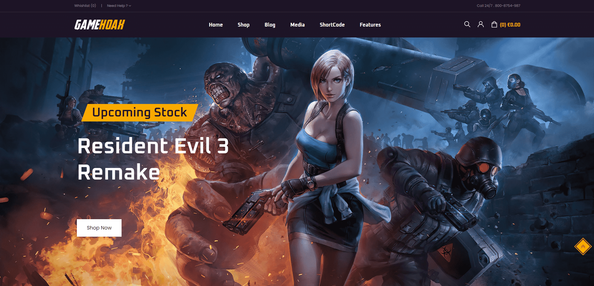

# GameHoax - Sito Web di E-commerce per Videogiochi

## Descrizione del Progetto

GameHoax è un sito web di e-commerce specializzato nella vendita di videogiochi per diverse piattaforme e hardware correlato. Questo progetto, focalizzato sulla home page, è stato sviluppato come esercizio di studio per dimostrare competenze in front-end development, con particolare attenzione all'uso di Vue.js per la creazione di interfacce utente dinamiche e reattive.

## Funzionalità Principali

### Interfaccia Utente
* Layout intuitivo per la presentazione di prodotti e categorie
* Header con navigazione principale e funzionalità di ricerca

### Presentazione dei Prodotti
* Visualizzazione di videogiochi e hardware in evidenza
* Categorizzazione dei prodotti per piattaforma o tipo di hardware
* Anteprima dei prodotti con immagini e informazioni essenziali

### Funzionalità Interattive
* Menu di navigazione per accedere alle diverse sezioni del sito
* Possibile implementazione di uno slider per prodotti in primo piano
* Area per le offerte speciali o le ultime novità

## Tecnologie Utilizzate
* **HTML5**: Struttura semantica della pagina
* **CSS3**: Styling avanzato e layout responsive
* **JavaScript (ES6+)**: Logica di programmazione e manipolazione del DOM
* **Vue.js**: Framework per la creazione di interfacce utente reattive (ultima versione disponibile)

## Visualizzare il Progetto

Il progetto è visionabile tramite GitHub Pages al seguente indirizzo: [Inserire qui il link a GitHub Pages]

